# **Battleships**

## Introduction

"Battleships" is an application based on the popular board game
“Battleships”. This implementation has been carried out in the Python
programming language, and is represented graphically on a computer
terminal using text and graphic characters of the ANSI standard.

Because the visual representation of the game is limited by the
graphical capabilities of standard ANSI terminals, the level of
graphical detail is very basic, but commensurate with the simplicity of
the game.

This application can be run in a local console, or, if we wanted to
deploy it on an application server like Heroku, in a simulation of a
terminal, in a web browser.

I hope you enjoy this simple implementation of this popular game.

**Table of Contents**

* [Introduction](#__RefHeading___Toc10007_2330999021)
* ["Battleships", The game](#battleships-the-game)
  * [Boards](#boards)
  * [Ships](#ships)
  * [Game development](#game-development)
  * [End of the battle (end of the game)](#end-of-the-battle-end-of-the-game)
    * [There is a winner:](#there-is-a-winner)
    * [A tie:](#a-tie)
* [Project Scope](#project-scope)
  * [Differences from the original game](#differences-from-the-original-game)
    * [Players:](#players)
    * [The boards:](#the-boards)
    * [The ships:](#the-ships)
    * [The winner:](#the-winner)
* [User experience (UX)](#user-experience-ux)
  * [Functional specifications](#functional-specifications)
    * [Goals](#goals)
    * [User requirements](#user-requirements)
  * [User Interface (UI) Design](#user-interface-ui-design)
    * [Logic](#logic)
      * [Main menu flowchart](#main-menu-flowchart)
      * [Game flowchart](#game-flowchart)
      * [Player turn flowchart](#player-turn-flowchart)
    * [Sketches](#sketches)
* [Implementation](#implementation)
  * [Definition of classes](#definition-of-classes)
    * [Class Ship():](#class-ship)
      * [Method check\_coordinates():](#method-check_coordinates)
      * [Method receive\_shot():](#method-receive_shot)
    * [Class battle\_zone():](#class-battle_zone)
  * [Graphics management](#graphics-management)
    * [ANSI Commands](#ansi-commands)
  * [Actual state](#actual-state)
    * [Home screen and player name change](#home-screen-and-player-name-change)
    * [Main Menu](#main-menu)
    * [Battle zone resizing screen](#battle-zone-resizing-screen)
    * [Initial ship positioning screen](#initial-ship-positioning-screen)
    * [Final screen for ship positioning and start of the game](#final-screen-for-ship-positioning-and-start-of-the-game)
    * [Computer's shooting turn](#computers-shooting-turn)
    * [Player's turn to shoot, screen in advanced game state](#players-turn-to-shoot-screen-in-advanced-game-state)
    * [Player's victory](#players-victory)
    * [Player's defeat](#players-defeat)
  * [Future improvements](#future-improvements)
    * [Create a predictive algorithm](#create-a-predictive-algorithm)
    * [Allow two humans to play online](#allow-two-humans-to-play-online)
    * [Add a ranking list](#add-a-ranking-list)
* [Testing and debugging](#testing-and-debugging)
  * [Automated testing](#automated-testing)
    * [tests.py file](#tests.py-file)
  * [Manual Testing](#manual-testing)
  * [Bugs](#bugs)
* [Deployment](#deployment)
  * [Heroku](#heroku)
  * [How to Clone the repository to your GitHub account](#how-to-clone-the-repository-to-your-github-account)
* [Credits](#credits)

###   

## "Battleships", The game

Battleships It is a traditional game of strategy and some luck,
involving two participants.

### Boards

Players manage an ocean board and a shoting board; each one divided into
boxes. Each board represents a different area of ​​the open sea: your
own and your opponent's. On the first board, the player places his ships
and records the opponent's "shots"; in the other, one's own shots
against the other player are recorded, differentiating between impacts
and those that hit the water.

### Ships

At the beginning, each player positions their ships on the first board,
secretly, invisible to the opponent.​

Each person occupies, according to their preferences, the same number of
squares, horizontally and/or vertically, which represent their ships.
Both participants must place the same number of ships, so it is common,
before starting, to stipulate by mutual agreement the number and size of
the ships that will be positioned on the board. Thus, for example, five
consecutive squares make up an aircraft carrier; four, a battleship;
three, a submarine; two, a destroyer; and an isolated square, a patrol
boat.

The participants could agree, for example, to each place two aircraft
carriers, three battleships and five patrol boats. The ships cannot be
placed close to each other.

### Game development

Once all the ships have been positioned, a series of rounds begins. In
each round, each player in turn "shoots" towards his opponent's fleet,
indicating a position (the coordinates of a square), which is recorded
on the second board. If that position is occupied by an opposing ship,
the opponent will call Damaged\! (Hit\!, Touch\!, or Impact\!) if there
are still parts of the ship (squares) undamaged, or Sunk\!, and With
that shot the ship has been completely destroyed (that is, if the
correct one is the last of the squares that make up the ship that
remained to be hit). The player who hit a ship in his previous move will
shoot again until he misses. If the indicated position does not
correspond to a part of any ship, it will scream Water\!\!

Each player will reference on that second board, differently and at
their convenience, the shots that have fallen on an opponent ship and
those that have fallen into the sea: in the implementation of the game
with pencil and paper, missed shots can be marked with a cross, and with
a circle those that match a ship, or with hollow and filled squares, as
seen in the image. In the version with boards, pins of one colour are
used for successes and another for failures.

### End of the battle (end of the game)

The game can end with a winner or a tie:

#### There is a winner:

Whoever destroys all of his opponent's ships first will be the winner
(as in so many other games in which you participate in turns, in the
event that the participant who started the game sinks in his last move
his opponent's last ship that was left afloat, the other participant has
the right to one last chance to achieve a tie, to a last shot that also
allows him to finish sinking the opposing fleet, which would mean a
tie);

#### A tie:

Although the usual thing is to continue the game until there is a
winner, a tie can also be reached if, after each player has fired the
same fixed and predetermined number of shots (as a variant allowed in
the game), both players have hit the same number of opposing squares.

## Project Scope

Since the project is implemented using the graphical possibilities
offered by a standard ANSI terminal, there are not many possibilities
for graphic detail or animations, and even if it could be done, this
project is limited to implementing the game functionality the most
simple and efficient way.

Even despite the limitations, the aim is to create a game that allows
the user to enjoy entertainment with simple and intuitive operation.

### Differences from the original game

#### Players:

In this implementation of the game, there are two players, but one of
them is always the computer.

#### The boards:

The original game uses two boards, one for each player. In this
implementation, we limit ourselves to graphically presenting only the
human player's board, although internally the application use both
boards.

#### The ships:

While in the original game the number of ships, their type and their
size could be agreed upon in advance, in this implementation we have
limited it to the following

  * An aircraft carrier, size 5
  * A battleship, size 4
  * One destroyer, size 3
  * A submarine, size 3
  * A patrol boat, size 2

Although the implementation will try to be carried out in such a way
that this specification can be easily changed.

#### The winner:

In the original game, there is a possibility of a tie between both
players. This is possible because in each round of play, both players
have the opportunity to shoot, even though all their ships have already
sunk.

In this implementation, the winner is established as the first of the
two who has managed to sink all of his opponent's ships, whether it is
the player or the computer. This way there can never be a tie. Since the
player always starts the shooting round, he is always half a turn ahead
of the computer.

## User experience (UX)

This project can be classified as a video game, and, by Therefore, in
the user experience the concept of "playability" must be especially
present where the purpose of the application is oriented towards user
enjoyment with the interaction.

### Functional specifications

#### Goals

  - The user must be able to know at all times how to interact with the
    game. The user must be guided with sufficiently clear messages.

  - The graphic representation has to be attractive but simple and
    functional.

  - It should try to make the user experience personal.

#### User requirements

  - The user must be able to identify themselves with their name to have
    a personalized experience

  - The user will be able to specify the size of the battlefield to
    decide the duration of the game

  - The user will be free to place his pieces in any position and at any
    point on the battlefield to try to hide

  - The user will be free to shoot at any point on the battlefield

  - The user will not be able to repeat a firing position used in their
    previous turns.

  - The User will be able to perform automatic random shots to allow for
    a further simple interaction.

### User Interface (UI) Design

#### Logic

##### Main menu flowchart  

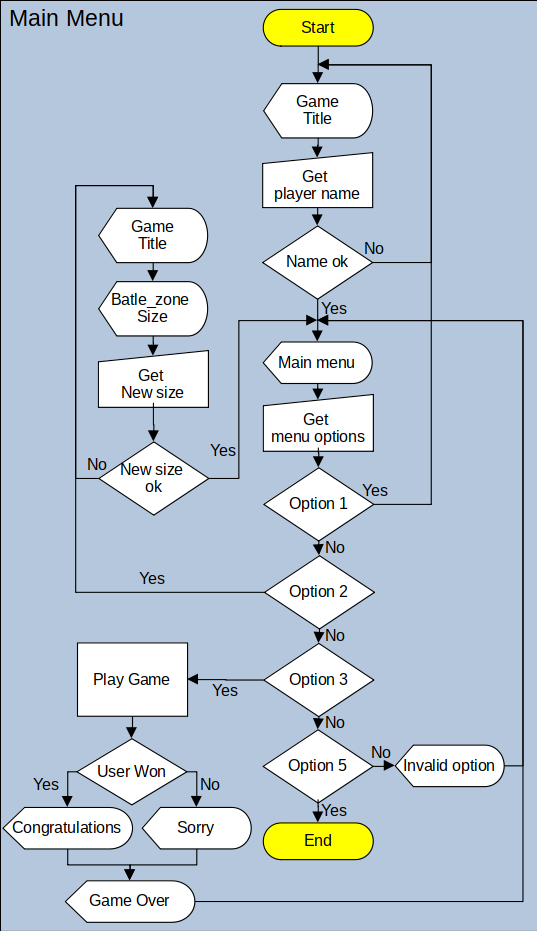

##### Game flowchart

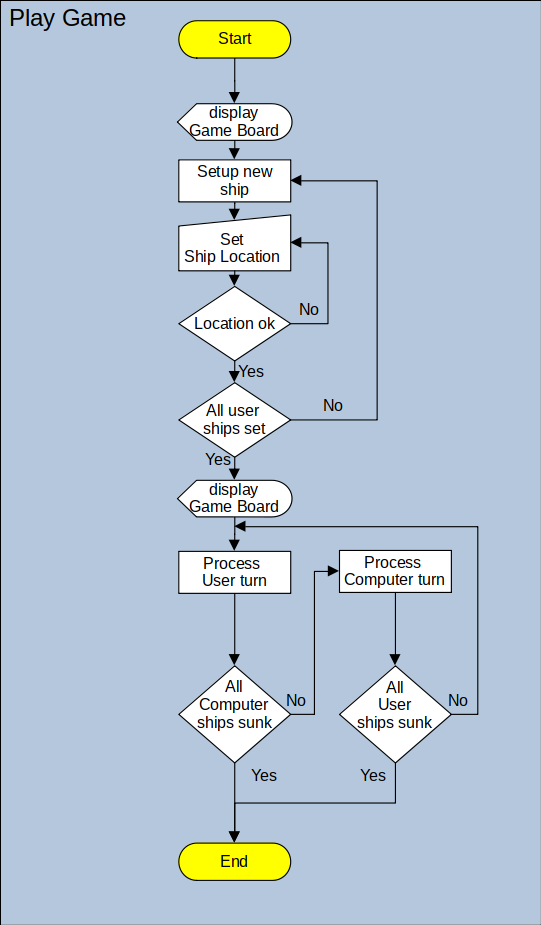


##### Player turn flowchart

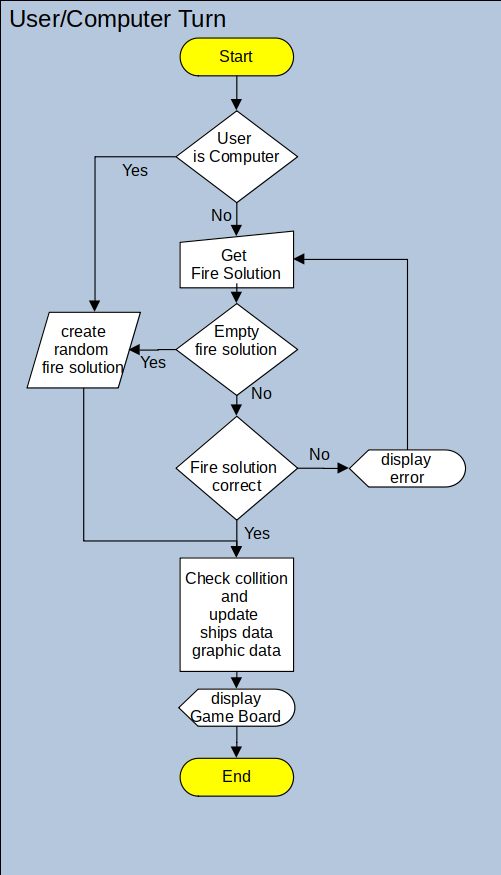

#### Sketches

To get an idea of how the game screen could be organised, I created a
sketch of how the information could be distributed. This sketch allows
me to calculate the maximum and minimum sizes of the combat zone as well
as the available lines for messages.

To avoid excessive deformation in the representation of the combat zone,
in each grid in which the combat zone is divided we will use one line
and two columns of the terminal.

We assume that the game will be displayed on a standard ANSI terminal
which has 80 columns and 24 lines. We calculate that the combat zone can
be a maximum of 12 grids wide and 10 grids high.

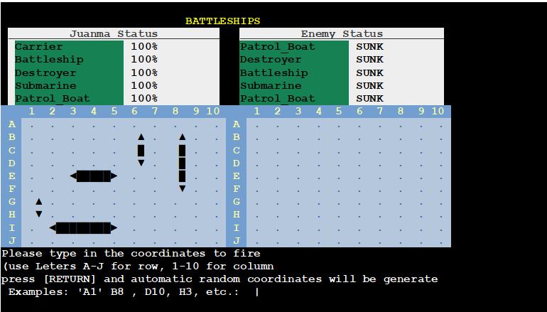

## Implementation

For the implementation of the application, the Python language was used,
as this is one of the requirements of the project.

OOP has been chosen as the programming paradigm, as the characteristics
of the project seem to fit very clearly to this programming model.

### Definition of classes

In order to keep programming complexity to a minimum, only two main
classes have been defined that will support all objects in the
application.

#### Class Ship():

This class describes a generic ship, where ship type, size, position on
the board, current state etc. are defined.

From this class inherit ship-specific classes that have predefined size
and their designation, which is forced to be the same as the name of the
class:

  - Class Patrol\_Boat(ship): size = 2squares

  - Class Submarine(ship): size = 3squares

  - Class Destroyer(ship): size = 3squares

  - Class Battleship(ship): size = 4squares

  - Class Carrier(ship): size = 5squares

The Ship class also implements two methods that form a fundamental part
of the application's business logic.

##### Method check\_coordinates():

This method checks if any part of the ship matches the coordinates
passed as arguments, returning RESULT\_HIT if there is a match, or
RESULT\_MISS if there is not.

##### Method receive\_shot():

This method uses the check\_coordinates() method to check if the ship
has been bombed, in which case it updates the ship's status information
and returns RESULT\_MISS in case there is no match, RESULT\_HIT in case
it has been hit, and RESULT\_SUNK in case all its grids have been hit.

Another function of this method is to update the graphical information
for later representation by the batle\_zone class.

#### Class battle\_zone():

This class defines the player's board data, such as the name, the board
dimensions and the actual information of the combat zone (grid) and the
damage suffered by the opponent (radar).

This class is instantiated twice in each game, once for the player's
board information, and once for the computer's information. And it
defines the necessary methods to perform the graphical representation of
the game board on the terminal.

By creating two identical objects for the player and the computer, the
operation of the application is greatly simplified, but above all it
greatly simplifies the testing procedures for debugging, since the logic
is the same for the player and for the computer.

### Graphics management

Each instantiated object of the battle\_zone class creates in each game
turn an image that could be represented on the terminal screen, although
in reality only the human player's screen is displayed.

Trying to reduce the complexity of the graphic management, each object
of the battle\_zone class has a symbolic representation of its game
board, and in each game turn, the procedure display\_battle\_zone() is
executed with the corresponding battle\_zone object of the human player
as argument.

display\_battle\_zone() in turn, uses the display\_title(),
display\_status() and display\_grids() procedures to, in a single sweep,
clear the entire screen and display the title, the game status and the
panels of the battle zone (grid) and the damage suffered by the opponent
(radar).

By using this technique, we avoid using on-screen object positioning and
again simplify graphics management.

#### ANSI Commands

An important part of graphics management relies on the ability of ANSI
standard terminals to interpret commands using primitives called "escape
sequences".

These escape sequences define the text attributes of the characters that
precede them, giving them colour, formatting and even animation.

In the ansi\_commands.py file, these basic ANSI commands are defined and
tokenised into constants so that they can be easily combined to create
complex commands in a simple way.

In the file battleships\_colors.py and by combining the different ANSI
commands, the constants that will be used as text attributes for the
output to the ANSI terminal are defined.

As these definitions are specific to this project, we have tried to give
the constants names that practically indicate where they will be used.

The tables for assigning screen/text attributes to game elements are
defined in the battleships\_classes.py file.

We have tried to make the definition of the mapping tables flexible and
efficient, even at the cost of adding some complexity to the project.

The attribute mapping tables are binary mapped, allowing us to perform
boolean operations with predefined binary masks, to filter which screen
elements have to have which attributes in which situation.

.

### Actual state

#### Home screen and player name change

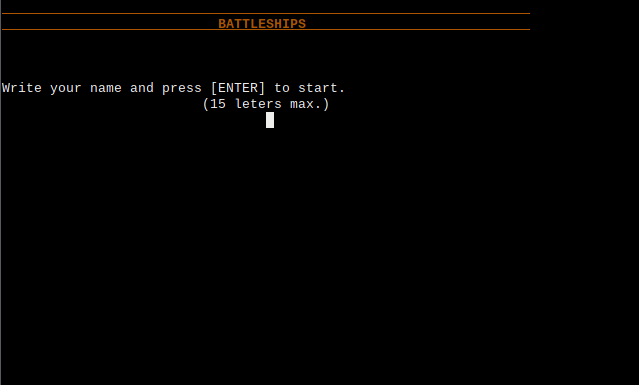

#### Main Menu

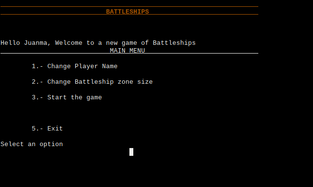

#### Battle zone resizing screen  

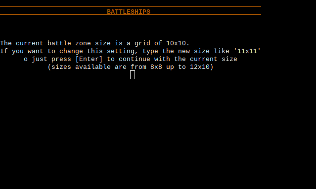

#### Initial ship positioning screen

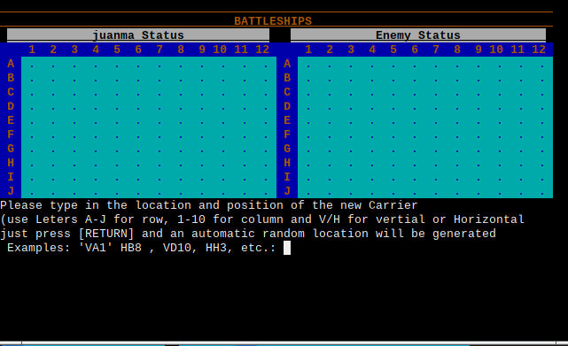

#### Final screen for ship positioning and start of the game

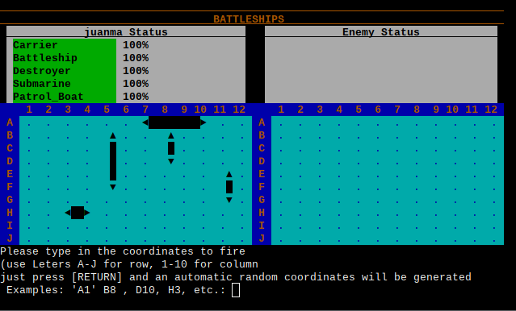

#### Computer's shooting turn

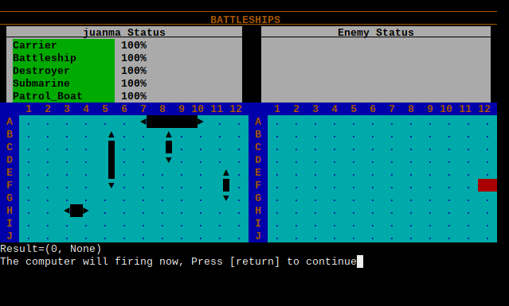

#### Player's turn to shoot, screen in advanced game state

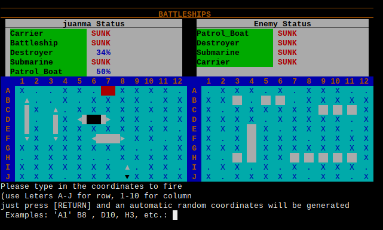

#### Player's victory

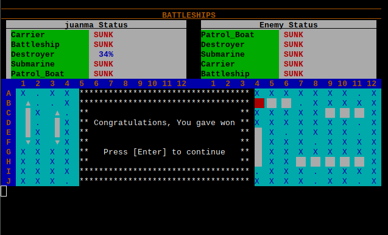

#### Player's defeat

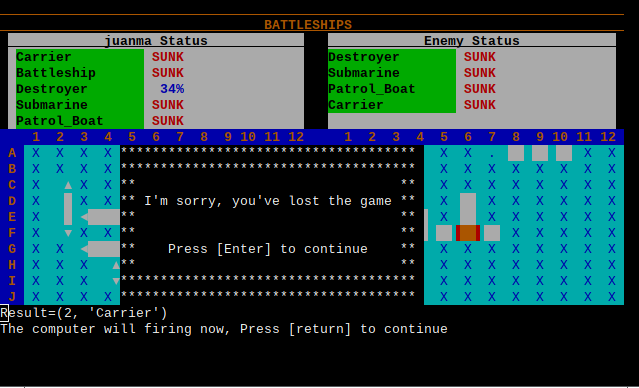

### Future improvements

#### Create a predictive algorithm

This would allow the automatic firing of the player and the computer to
be more logical and thus make the game much more interesting. In this
way it would also be possible to define difficulty levels.

#### Allow two humans to play online

To realise this improvement, it would be necessary to link two
applications using some kind of communications protocol.

#### Add a ranking list

to implement this improvement, some kind of scoring system should be
created, and recording the result of each game in a permanent way so it
would be possible to display a list of players sorted by score.

## Testing and debugging

### Automated testing

For debugging the application, when the definition of the battle\_zone()
class was created, it was done with the idea in mind of creating a test
procedure that would verify the correct functioning of the game logic.

Although the "business logic" of the application may seem a bit complex,
the mechanism is actually quite simple to test. For this purpose, the
file tests.py was created.

#### tests.py file

This file defines the Tests class which implements two main methods. The
fire\_shot() method that allows the simulation of a player's turn to
shoot. And the receive shot() method that simulates the reception of the
shot by the opponent.

This class relies heavily on the functionality of the battle\_zone()
class which gives it the ability to display the results graphically to
the programmer, allowing them to see the outcome of each test.

This class also generates a detailed and summarised report of all the
tests performed.

To perform the tests, two instances of the batle\_zone class are
defined, one representing the player, and the other representing the
computer.

Both instances are given the same ships using the new\_ship() method.

Then the instance of the Tests class is created by passing the two
created instances of battle\_zone as arguments.

At this point the test mechanism is ready to run the tests we want.

We can create the fire\_shot() and receive\_shot tests we want by
passing the coordinates we want and the expected results. The Tests
instance will take care of running the test for both the player and the
computer, and compare the results with the expected results and account
for any discrepancy. If desired, you can also request that the state of
the game screen be displayed for each test so that a visual analysis of
the results can be made. You can also display the status of the player
and computer screens at the end of all tests. There should be no
difference between the player and computer screens, as they have passed
exactly the same tests.

**Tests Examples:**

Here are some of the tests scheduled
```
tests.receive_shot(coordinates=( 0, 1),    expected_result=RESULT_COLUMN_ERROR, test_name="COLUMN ERROR (toolow)")
tests.receive_shot(coordinates=( 1,ROWS+1),expected_result=RESULT_ROW_ERROR, test_name="ROW ERROR (too high)")

tests.fire_shot(coordinates=( 1, 1), expected_result=RESULT_MISS,       test_name="MISS (top-left)")
tests.fire_shot(coordinates=( 1, 1), expected_result=RESULT_DUPLICATED, test_name="Duplicated shot")
tests.fire_shot(coordinates=( 2, 3), expected_result=RESULT_SUNK,       test_name="HIT unit 2 Patrol_Boat, SUNK")
```
Once the tests are completed, the results are recorded in two files, one
for the player's and one for the computer's. If everything is correct,
both files will be identical. If everything is correct, both will be
identical.

As the results are recorded in dictionary or json format, if necessary,
they can be processed automatically as part of a more automated testing
system.

**Results Examples:**

Here are some of the results of the tests carried out
```
{
"test_receive_shot": {
    "Test_number": 1,
    "Name": "COLUMN ERROR (too low)",
    "Result": "OK",
    "Coordinates": \[0,1\],
    "Expected_result": -1,
    "Actual_result": -1,
    "Ship": "None"
    }
},
{
"test_receive_shot": {
    "Test_number": 2,
    "Name": "COLUMN ERROR (too high)",
    "Result": "OK",
    "Coordinates": \[11,1\],
    "Expected_result": -1,
    "Actual_result": -1,
    "Ship": "None"
    }
},
{
"test_receive_shot": {
    "Test_number": 1,
    "Name": "COLUMN ERROR (too low)",
    "Result": "OK",
    "Coordinates": \[0,1\],
    "Expected_result": -1,
    "Actual_result": -1,
    "Ship": "None"
    }
}
``` 

By default, this application generates two files, /Results1.txt and
/Results2.txt containing the test results of the player instance and the
computer respectively.

### Manual Testing

Since user interaction with the application is very limited, all user
interface tests have been performed manually, entering maximum, minimum,
exceeding the defined maximum and minimum values, and entering incorrect
type data.

### Bugs

All bugs in the control logic were detected and corrected during the
development of the application. Once the application was in alpha
version, only bugs were found during manual testing of the user
interface.

  - **Bug:** When entering, from the terminal, the position of the new
    ship, the returned value HORIZONTAL (0) is interpreted by Python as
    False, giving as invalid the information entered.
    
    **Fix:** make the specific check of the value None for when you want
    a boat positioned in automatic mode.

  - **Bug:** the player is not presented, with a text, with the result
    of his last shot.
    
    **Fix:** Text messages are added with the result of the last shot.

  - **Bug:** No indication when the player name entered is too long.
    
    **Fix:** An error message is added indicating that the name is too
    long.

## Deployment

### Heroku

  - The following steps indicate how to deploy the application on the
    Heroku application service

  - Clone the https://github.com/Juanma1313/battleships.git repository
    into your own github account.

  - You can find instructions on how to clone the repository below.

  - Login or register a new account on Heroku

  - Use the "New" option in the control panel and select "Create new
    app".

  - Select a name for the app, such as "Battleships" and choose your
    region.

  - Use the "Create app" option and wait for the configuration tabs to
    appear.

  - select the "Settings" tab

  - It is recommended to use the "Reveal Config Vars" option and add a
    new variable:
    
    KEY = PORT , VALUE = 8000

  - Use the "Add buildpack" option to add first "Python" and then
    "Nodejs".

  - Choose the "Deploy" tab and use the option "GitHub" (connect to
    GitHub")

  - Scroll down and click on "Connect to GitHub".

  - In the repository search option, type the name of the repository you
    have created in your github account. Using the "Search" option, it
    should find it and appear with a "Connect" option next to it.

  - Use the "Connect" option and wait for the new "Deploy Branch" option
    to appear.

  - Use the "Deploy Branch" option and wait until the deployment is
    complete.

  - Once you receive the message "The app was successfully deployed" you
    can access the deployed application.

### How to Clone the repository to your GitHub account 

  - Start session or register a new account in github.com

  - Enter the "Repositories" tab and use the option "New" to create a
    new repository.

  - Use the "import to repository" option

  - In the option "Your old repository's clone URL \*" enter my
    repository "https://github.com/Juanma1313/battleships.git"

  - Give your own repository name and use the "Beguin import" option to
    start the import.

  - Once the process is finished,you should have an exact copy of my
    repository in your GitHub account.
    
    1.  ## Credits

<!-- end list -->

  - **StackOverflow** with some probmottos specifically with Python

  - **Wikipedia** made it easier for me for the most partinformation
    regarding ANSI and its Escape Code sequences

  - **Microsoft Visual Studio Code** has been used as the main
    development environment.

  - **Code institute Python Linter** has been used forfor PEP8 format
    revision.
