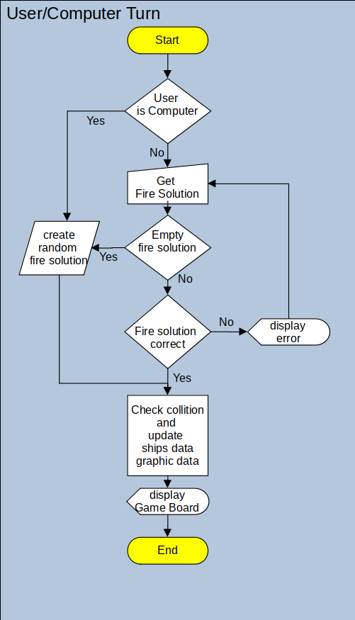
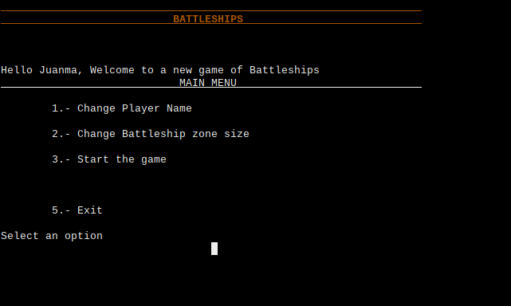
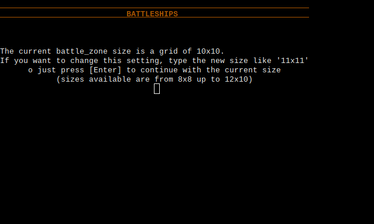
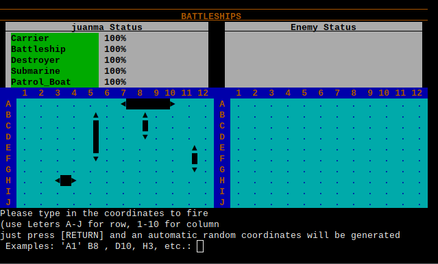
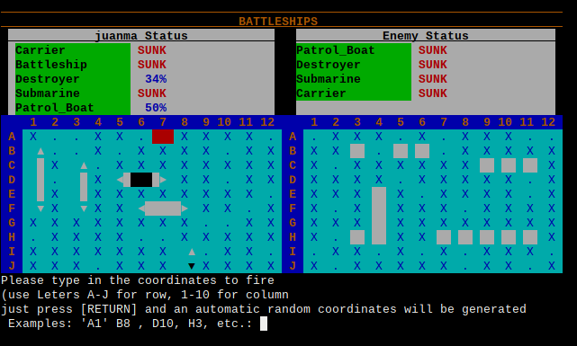

## Introducción

"Batleship" es un aplicativo basado en el popular juego de mesa “Batalla
naval”. Esta implementación se ha realizado en lenguaje de programación
Python, y se representa gráficamente en un terminal de computadora
usando caracteres de texto y gráficos del estándar ANSI.

Debido a que la representación visual del juego está limitada por las
capacidades gráficas de los terminales ANSI estándar, el nivel de
detalle gráfico es muy básico, pero acorde con la sencillez del juego.

Este aplicativo se puede ejecutar en una consola local, o , si
deseáramos desplegarlo en un servidor de aplicaciones como Heroku, en
una simulación de terminal en un navegador web .

Deseo que disfruten con esta sencilla implementación de este popular
juego.

**Tabla de Contenidos**

[Introducción](#introducción)

["Batalla Naval", El juego](#batalla-naval-el-juego)

[Tableros](#tableros)

[Naves](#naves)

[Desarrollo del juego](#desarrollo-del-juego)

[Fin de la batalla (fin del juego)](#fin-de-la-batalla-fin-del-juego)

[Hay ganador:](#hay-ganador)

[Empate:](#empate)

[Alcance del proyecto](#alcance-del-proyecto)

[Diferencias con el juego original](#diferencias-con-el-juego-original)

[Los jugadores:](#los-jugadores)

[Los tableros:](#los-tableros)

[Las Naves:](#las-naves)

[El ganador:](#el-ganador)

[Experiencia de usuario (UX)](#experiencia-de-usuario-ux)

[Especificaciones funcionales](#especificaciones-funcionales)

[Objetivos](#objetivos)

[Requerimientos del usuario](#requerimientos-del-usuario)

[Diseño de la interfaz de usuario
(UI)](#diseño-de-la-interfaz-de-usuario-ui)

[Lógica](#lógica)

[Diagrama de flujo del menu
principal](#diagrama-de-flujo-del-menu-principal)

[Diagrama de flujo del guego](#diagrama-de-flujo-del-guego)

[Diagrama de flujo del turno de
gugador](#diagrama-de-flujo-del-turno-de-gugador)

[Bocetos](#bocetos)

[Implementación](#implementación)

[Definición de las clases](#definición-de-las-clases)

[Clase Ship():](#clase-ship)

[método check\_coordinates():](#método-check_coordinates)

[receive\_shot():](#receive_shot)

[Clase battle\_zone():](#clase-battle_zone)

[Gestión gráfica](#gestión-gráfica)

[ANSI commands](#ansi-commands)

[Estado actual](#estado-actual)

[Pantalla de inicio y de cambio de nombre del
jugador](#pantalla-de-inicio-y-de-cambio-de-nombre-del-jugador)

[Menu principal](#menu-principal)

[Pantalla de cambio de tamaño de la zona de
batalla](#pantalla-de-cambio-de-tamaño-de-la-zona-de-batalla)

[Pantalla inicial de posicionamiento de
naves](#pantalla-inicial-de-posicionamiento-de-naves)

[Pantalla final de posicionamiento de naves e inicio del
juego](#pantalla-final-de-posicionamiento-de-naves-e-inicio-del-juego)

[Pantalla del turno de disparo de la
computadora](#pantalla-del-turno-de-disparo-de-la-computadora)

[Pantalla de turno de disparo del jugador en estado avanzado del
juego](#pantalla-de-turno-de-disparo-del-jugador-en-estado-avanzado-del-juego)

[Pantalla de victoria del jugador](#pantalla-de-victoria-del-jugador)

[Pantalla de derrota del jugador](#pantalla-de-derrota-del-jugador)

[Mejoras futuras](#mejoras-futuras)

[Crear un algoritmo predictivo](#crear-un-algoritmo-predictivo)

[Permitir jugar a dos humanos
online](#permitir-jugar-a-dos-humanos-online)

[Añadir una lista de ranking](#añadir-una-lista-de-ranking)

[Testing y depuración](#testing-y-depuración)

[Testing automático](#testing-automático)

[archivo tests.py](#archivo-tests.py)

[Testing manual](#testing-manual)

[Errores](#errores)

[Despliegue](#despliegue)

[Heroku](#heroku)

[Como Clonar el respositorio a tu cuenta de
github](#como-clonar-el-respositorio-a-tu-cuenta-de-github)

[Créditos](#créditos)

###   

## "Batalla Naval", El juego

La batalla naval (juego de los barquitos o hundir la flota, nombre con
el que se comercializó en España el juego de mesa; hundiendo barquitos,
en algunos lugares de Hispanoamérica), del nombre en inglés "Battleship"
, es un juego tradicional de estrategia y algo de suerte, que involucra
a dos participantes.

### Tableros

Los jugadores manejan un tablero de océano y un tablero de tiro ; cada
uno divididos en casillas. Cada tablero representa una zona diferente
del mar abierto: la propia y la contraria. En el primer tablero, el
jugador coloca sus barcos y registra los «tiros» del oponente; en el
otro, se registran los tiros propios contra el otro jugador,
diferenciando los impactos y los que dan al agua.

### Naves

Al comenzar, cada jugador posiciona sus barcos en el primer tablero, de
forma secreta, invisible al oponente.​

Cada quien ocupa, según sus preferencias, una misma cantidad de
casillas, horizontal y/o verticalmente, las que representan sus naves.
Ambos participantes deben ubicar igual número de naves, por lo que es
habitual, antes de comenzar, estipular de común acuerdo la cantidad y el
tamaño de las naves que se posicionarán en el tablero. Así, por ejemplo,
cinco casillas consecutivas conforman un portaaviones; cuatro, un buque;
tres, un submarino; dos, un crucero; y una casilla aislada, una lancha.

Los participantes podrían convenir, por ejemplo, colocar, cada uno, dos
portaaviones, tres buques y cinco lanchas. No se podrán colocar barcos
pegados entre sí.

### Desarrollo del juego

Una vez todas las naves han sido posicionadas, se inicia una serie de
rondas. En cada ronda, cada jugador en su turno «dispara» hacia la flota
de su oponente indicando una posición (las coordenadas de una casilla),
la que registra en el segundo tablero. Si esa posición es ocupada por
parte de un barco contrario, el oponente cantará ¡Averiado\! (¡Toque\!,
¡Tocado\! o ¡Impacto\!) si todavía quedan partes del barco (casillas)
sin dañar, o ¡Hundido\! si con ese disparo la nave ha quedado totalmente
destruida (esto es, si la acertada es la última de las casillas que
conforman la nave que quedaba por acertar). El jugador que ha tocado un
barco en su anterior jugada, volverá a disparar hasta que falle. Si la
posición indicada no corresponde a una parte de barco alguno, cantará
¡Agua\!.

Cada jugador referenciará en ese segundo tablero, de diferente manera y
a su conveniencia, los disparos que han caído sobre una nave oponente y
los que han caído al mar: en la implementación del juego con lápiz y
papel, pueden señalarse con una cruz los tiros errados y con un círculo
los acertados a una nave, o con cuadrados huecos y rellenos, como se ve
en la imagen. En la versión con pizarras, se utilizan pines de un color
para los aciertos y de otro para las marras.

### Fin de la batalla (fin del juego)

El juego puede terminar con un ganador o en empate:

#### Hay ganador: 

Quien destruya primero todas las naves de su oponente será el vencedor
(como en tantos otros juegos en los que se participa por turnos, en caso
de que el participante que comenzó la partida hunda en su última jugada
el último barco de su oponente que quedaba a flote, el otro participante
tiene derecho a una última posibilidad para alcanzar el empate, a un
último disparo que también le permita terminar de hundir la flota
contraria, lo que supondría un empate);

#### Empate:

Si bien lo habitual es continuar el juego hasta que haya un ganador, el
empate también puede alcanzarse si, tras haber disparado cada jugador
una misma cantidad de tiros fija y predeterminada (como una variante
permitida en el juego), ambos jugadores han acertado en igual número de
casillas contrarias.

## Alcance del proyecto

Dado que el proyecto se implementa usando las posibilidades gráficas que
nos ofrece un terminal standard ANSI, no hay muchas posibilidades de
detalle gráfico o animaciones, y si bien estas podrian ser posibles,
este proyecto se limita a implementar la funcionalidad del juego de la
manera mas sencilla y eficiente.

Aun a pesar de las limitaciones, se pretende crear un juego que permita
al usuario disfrutar de entretenimiento con un funcionamiento sencillo e
intuitivo.

### Diferencias con el juego original

#### Los jugadores:

En esta implementación del juego, hay dos jugadores, pero uno de ellos
siempre es la computadora.

#### Los tableros:

El juego original utiliza dos tableros, uno para cada jugador. En esta
implementación nos limitamos a presentar gráficamente unicamente el
tablero del jugador humano, aunque internamente la aplicacion utilice
los dos tableros.

#### Las Naves:

Si bien en el juego original se pueden acordar de antemano el número de
naves, su tipo y su tamaño, en esta implementación lo hemos limitado a
las siguientes

\* Un portaviones, tamaño 5

\* Un acorazado, tamaño 4

\* Un destructor, tamaño 3

\* Un submarino, tamaño 3

\* Una patrullera, tamaño 2

Aunque la implementación se intentará realizar de manera que esta
especificacion pueda variarse facilmente.

#### El ganador:

En el juego original, existe la posibilidad de empate entre ambos
jugadores. Esto es posible porque en cada ronda de juego, ambos
jugadores tienen la oportunidad de disparar, aunque todos sus barcos ya
se hayan hundido.

En esta implementación, se establece como ganador, el primero de los dos
que haya conseguido hundir todos los barcos de su oponente, ya sea el
jugador o la compùtadora. De esta forma nunca puede haber un empate.
Como el jugador siempre inicia la ronda de disparos, éste tiene siempre
medio turno de ventaja sobre la computadora.

## Experiencia de usuario (UX)

Este proyecto se puede calificar como videojuego, y por lo tanto, en la
experiencia de usuario tiene que estar especialmente presente el
concepto de "jugabilidad" donde la finalidad del aplicativo esta
orientado al disfrute del usuario en la interaccion con este.

### Especificaciones funcionales

#### Objetivos

\* El usuario tiene que poder saber en todo momento como tiene que
interactuar con el juego. El usuario debe ser guiado con mensajes
suficientemente claros .

\* La representación gráfica tiene que ser atractiva pero sencilla y
funcional.

\* Se debe intentar que la experiencia sel usuario sea personal.

#### Requerimientos del usuario

\* El usuario se debe poder identificarse con su nombre para tener una
experiencia personalizada

\* El usuario podrá especificar el tamaño del campo de batalla para
decidir la duración del juego

\* El usuario podrá ser libre de colocar sus piezas en cualquier
posición y en cualquier punto del campo de batalla para tratar de
ocultar

\* El usuario podrá ser libre de disparar a cualquier punto del campo de
batalla

\* El usuario no podrá repetir una posición de disparo usada en sus
turnos anteriores.

\* El Usuario podrá realizar disparos automáticos alewatorios para hacer
mas sencilla su interacción.

### Diseño de la interfaz de usuario (UI)

#### Lógica

##### Diagrama de flujo del menu principal

##### Diagrama de flujo del guego

##### 

##### Diagrama de flujo del turno de gugador

#### Bocetos

Para hacerme una idea de como se podria organizar la pantalla de juego,
cree un boceto de como se podria distribuir la información. Este boceto
me permite calcular los tamaños maximos y mínimos de la zona de combate
asi como las lineas disponibles para mensajes.

Para evitar una excesiva deformación en la representación de la zona de
combate, en cada cuadricula en que se divide la zona de combate
utilizaremos una linea y dos columnas del terminal

Asumimos que el juego se visualizará en un terminal ANSI estandard el
cual cuenta con 80 columnas y 24 lineas. Calculamos que la zona de
combate puede tener un máximo de 12 cuadriculas de ancho y 10 de alto.

## Implementación

Para la implementación del aplicativo se utilizado el lenguage Python,
ya que este es uno de los requerimientos del proyecto.

Como paradigma de programación se ha optado por la OOP ya que las
características del proyecto parecen ajustarse muy claramente a este
modelo de programación.

### Definición de las clases

Para mantener al mínimo imprescindible la compejidad de programación,
san solo se han definido dos clases principares que soportarán todos los
objetos de la aplicación.

#### Clase Ship():

Esta clase describe un barco genérico, donde se define tipo de barco,
tamaño, posicion en el tablero, estado actual etc.

de esta clase heredan las clases especificas de barcos que tienen
predefinidos tamaño y su designación que se fuerza a ser el nombre de la
clase:

  - Clase Patrol\_Boat(ship): tamaño = 2 cuadriculas

  - Clase Submarine(ship) : tamaño = 3 cuadriculas

  - Clase Destroyer(ship): tamaño = 3 cuadriculas

  - Clase Battleship(ship): tamaño = 4 cuadriculas

  - Clase Carrier(ship): tamaño = 5 cuadriculas

La clase Ship tambien implementa dos métodos que forman parte
fundamental en la "busines logic" del aplicativo.

##### método check\_coordinates():

Este método comprueba si alguna parte del barco coincide con las
coordenadas pasadas como argumento devolviendo RESULT\_HIT si hay
coincidencia, o RESULT\_MISS en caso de no haberla.

##### receive\_shot():

Este método utiliza al método check\_coordinates() para comprobar si el
barco ha sido bombardeado, en cuyo caso actualiza la información del
estado del barco y devuelve RESULT\_MISS en caso de no haber
coincidencia, RESULT\_HIT en caso de haber sido alcanzado, y
RESULT\_SUNK en caso de que todas sus cuadrículas hayan sido alcanzadas.

Otra de las funciones de este método es la de actualizar la información
gráfica para su posterior representación por la clase batle\_zone.

#### Clase battle\_zone():

Esta clase define los datos del tablero del jugador, tales como el
nombre, las dimensiones del tablero y la propia información de la zona
de combate (grid) y el daño sufrido por el contrincante (radar).

Esta clase se instanciará dos veces en cada juego, una para la
información del tablero del jugador, y otra para la de la computadora.

Esta clase define los métodos mecesarios para realizar la representación
gráfica del tablero de juego en el terminal.

Al empear dos objetos identicos para el jugador y la computadora, se
simplifica mucho el funcionamiento de la aplicacion, pero sobre todo
simplifica enormemente los procedimientos de pruebas para la depuración,
ya que la ĺogica es la misma para el jugador que para la computadora.

Al ser un sistema simétrico, para depurar la aplicación, podemos ver
gráficamente tanto el resultado del jugador como el de la computadora.
y si simulamos disparos identicos a ambos tableros, los resultados
tienen que ser tambien identicos, con lo que es mucho más facil
encontrar discrepancias y fallos de funcionamiento.

### Gestión **gráfica**

Cada objeto instanciado de la clase battle\_zone crea en cada turno del
juego una imagen que podría ser representada en la pantalla del
terminal. aunque en realidad solo se visualiza la del jugador humano.

Tratando de reducir la complegidad de la gestión gráfica, cada objeto de
la clase battle\_zone dispone de una representación simbólica de su
tablero de juego, y en cada turno de juego, se ejecuta el procedimiento
display\_battle\_zone() con el objeto battle\_zone correspondiente del
jugador humano como argumento.

display\_battle\_zone() a su vez, utiliza los procedimientos
display\_title(), display\_status() y display\_grids() para en un único
barrido, borra toda la pantalla y mostrar el título, el estado del juego
y los paneles de la zona de combate (grid) y del daño sufrido por el
contrincante (radar).

Usando esta técnica, evitamos usar posicionamientos de objetos en
pantalla y nuevamente simplificamos la gestión de los gráficos.

#### ANSI commands

Una parte importante de la gestión gráfica recae en la capacidad de los
terminales estandard ANSI de interpretar comandos usando primitivas que
se denominan "secuencias de escape".

Estas secuencias de escape definen los atributos de texto de los
carácteres que le preceden, dotandolos de color, formato e incluso de
animación.

En el archivo ansi\_commands.py se definen estos comandos básicos de
ANSI y se tokenizan en constantes para poder combinarlos facilmente y
crear comandos complejos de manera sencilla.

En el archivo battleships\_colors.py y combinando las diferentes
comandos ANSI, e definen las constantes que se emplearan como atributos
de texto para la salida al terminal ASNI.

Como estas definiciones son específicas a este proyecto, se ha intentado
dar unos nombres a las constantes que practicamente indican donde se van
a emplear.

Las tablas de asignación de los atributos de pantalla/texto a los
elementos del juego se definen en el archivo battleships\_classes.py.

Se ha intentado que la definición de las tablas de asignación fuese
flexible y eficiente aun a costa de añadir un poco de complegidad al
proyecto.

Las tablas de asignación de atributos estan mapeadas en binario, con lo
que nos permite realizar operaciones booleanas con mascaras binarias
predefinidas, para filtrar que elementos de pantalla tienen que tener
que atributos en cada situación concreta.

### Estado actual

#### Pantalla de inicio y de cambio de nombre del jugador

#### Menu principal

#### Pantalla de cambio de tamaño de la zona de batalla

#### Pantalla inicial de posicionamiento de naves

#### Pantalla final de posicionamiento de naves e inicio del juego

#### Pantalla del turno de disparo de la computadora

#### Pantalla de turno de disparo del jugador en estado avanzado del juego

#### Pantalla de victoria del jugador

#### Pantalla de derrota del jugador

### Mejoras futuras

#### Crear un algoritmo predictivo 

Esto permitiria que los disparos automáticos del jugador y de la
computadora fuesen más lógicos y de esta manera hacer el juego mucho más
interesante. De esta manera ademas se podrian definir niveles de
dificultad.

#### Permitir jugar a dos humanos online

Para realizar esta mejora, sería necesario enlazar dos aplicaciones
usando algun tipo de protocolo de comunicaciones.

#### Añadir una lista de ranking

para implementar esta mejora, se deberia crear algun sistema de
puntuación, y grabando el resultado de cada partida de forma permanente
por lo que sería posible mostrar una lista de jugadores ordenada por
puntuación.

## Testing y depuración

### Testing automático

Para realizar el depuración de la aplicación, cuando se creó la
definicion de las clase battle\_zone() se hizo con la idea en mente de
crear un procedimiento de pruebas que verificara el correcto
funcionamiento de la lógica del juego.

Aunque la "busines logic" de la aplicación puede parecer algo compleja,
en realidad el mecanismo es bastante sencillo de probar. Para ello se
creo el archivo tests.py

#### archivo tests.py

En este archivo se define la clase Tests que implementa dos métodos
principales. El método fire\_shot() que pewrmite la simulación de un
turno de disparo de un jugador. Y el método receive shot() que simula la
recepción del disparo por parte del contrincante.

Esta clase se apoya enormemente en la funcionalidad de la clase
battle\_zone() que la otorga de la capacidad de mostrar los resultados
gráficamente al programador, permitiendo ver el resultado de cada
prueba.

Esta clase tambien genera un informe detallado y sumarizado de todas las
pruebas realizadas

Para realizar las pruebas se definen dos instancias de la clase
batle\_zone, una representa al jugador, y la otra representa a la
computadora.

A ambas instancias se las dota de los mismos barcos usando el método
new\_ship()

Luego se crea la instancia de la clase Tests pasandole las dos
instancias creadas de battle\_zone como argumentos.

En este momento el mecanismo de prueba ya esta listo para ejecutar las
pruebas que queramos.

Podemos crear las pruebas de fire\_shot() y receive\_shot que queramos
pasando las coordenadas que queramos y los resultados esperados. La
instancia de Tests se encargará de ejecutar la prueba tanto para el
jugador como para la computadora, y comparar los resultados con los
esperados y contabilizará cualquier discrepancia. Si se desea, tambien
se puede solicitar que se visualice el estado de la pantalla del juego
en cada prueba para poder hacer un análisis visual de los resultados.
Tambien se puede visualizar el estado de las pantallas del jugador y de
la computadora al final de todas las pruebas. No debería haber ninguna
diferencia entre la pantalla del jugador y la de la computadora, ya que
han pasado exactamente las mismas pruebas.

**Ejemplo de tests:**

Estas son algunas pruebas programadas

tests.receive\_shot(coordinates=( 0, 1),
expected\_result=RESULT\_COLUMN\_ERROR, test\_name="COLUMN ERROR (too
low)")

tests.receive\_shot(coordinates=( 1,
ROWS+1),expected\_result=RESULT\_ROW\_ERROR, test\_name="ROW ERROR (too
high)")

tests.fire\_shot(coordinates=( 1, 1), expected\_result=RESULT\_MISS,
test\_name="MISS (top-left)")

tests.fire\_shot(coordinates=( 1, 1),
expected\_result=RESULT\_DUPLICATED, test\_name="Duplicated shot")

tests.fire\_shot(coordinates=( 2, 3), expected\_result=RESULT\_SUNK,
test\_name="HIT unit 2 Patrol\_Boat, SUNK")

Una vez finalizadas las pruebas, se procede a grabar los resultados en
dos archivos, uno para los de el jugador y otro para los de la
computadora. Si todo es correcto, ambos seran identicos.

Al estar grabados los resultados en formato diccionario o json, si fuese
necesario, estos se pueden procesar automáticamente como parte de un
sistema más automatizado de pruebas.

**Ejemplo de resultados:**

Estos son algunos resultados de las prueba realizadas

**{**

**"test\_receive\_shot": {**

**"Test\_number": 1,**

**"Name": "COLUMN ERROR (too low)",**

**"Result": "OK",**

**"Coordinates": \[0,1\],**

**"Expected\_result": -1,**

**"Actual\_result": -1,**

**"Ship": "None"**

**}**

**},**

**{**

**"test\_receive\_shot": {**

**"Test\_number": 2,**

**"Name": "COLUMN ERROR (too high)",**

**"Result": "OK",**

**"Coordinates": \[11,1\],**

**"Expected\_result": -1,**

**"Actual\_result": -1,**

**"Ship": "None"**

**}**

**},**

**{ {**

**"test\_receive\_shot": {**

**"Test\_number": 1,**

**"Name": "COLUMN ERROR (too low)",**

**"Result": "OK",**

**"Coordinates": \[0,1\],**

**"Expected\_result": -1,**

**"Actual\_result": -1,**

**"Ship": "None"**

**}**

Por defecto, esta aplicación genera dos archivos /Results1.txt y
/Results2.txt que contienen los resultados de las pruebas de la
instancia del jugador y de la computadora respectivamente.

### Testing **manual**

Dado que la interacción del usuario con la aplicación está muy limitada,
todas las prruebas de la interfaz de usuario se han realizado
manualmente, introduciendo los valores máximos, minimos, superando los
máximos y los mínimos definidos,e introduciendo datos de tipos
incorrectos.

### Errores 

Todos los bugs de la lógica de control fueron detectados y se
corrigieron durante el sesarrollo de la aplicación. Una vez la
aplicación sestuvo en versión alfa, solo se encontraron bugs al
realizar el testing manual de la interfaz de usuario.

\* **Bug:** Al introducir, desde el terminal, la posicion del nuevo
barco, el valor retornado HORIZONTAL (0) es interpretado por Python como
False. dando como invalida la información introducida.

**Fix:** hacer la comprobación específica del valor None para cuando se
desee un barco posicionado en modo automático

\* **Bug:** no se presenta al jugador, con un texto, el resultado de.su
último disparo.

**Fix:** Se añaden mensajes de texto con el resultado del último disparo

**\* Bug:** No se indica cuando el nombre de jugador introducido es
demasiado largo.

**Fix:** Se añade un mensaje de error indicando que el nombre es
demasiado largo

## Despliegue

### Heroku

Los siguientes pasos indican como desplegar el aplicativo en el servicio
de aplicaciones Heroku

  - Clona el repositorio https://github.com/Juanma1313/battleships.git
    en tu propia cuenta github
    
    Puedes encontrar las instrucciones de como clonar el repositorio un
    poco mas abajo.

  - Inicia sesión o registra una nueva cuenta en Heroku

  - Usa la opción "Nuevo" en el panel de control y seleccione "Crear
    nueva app".

  - Selecciona un nombre para la app, como por ejemploe "Battleships" y
    elige tu región.

  - Usa la opción "Crear app" y esperar a que aparezcan las solapas de
    configuración.

  - seleccionar la solapa "Settings"

  - Es recomendable usar la opción "Reveal Config Vars" y añadir una
    nueva variable:
    
    KEY = PORT , VALUE = 8000

  - Usa la opción "Add buildpack" para añadir primero "Python" y luego
    "Nodejs"

  - Elegir la solapa "Deploy" y usa la opción "GitHub" (connect to
    GitHub")

  - Desplazate hacia abajo y haga clic en "Conectar a GitHub".

  - En la opción de busqueda del repositorio, escribe el nombre del
    repositorio que has conado en tu cuenta de github. Al usar la
    copción "Search" debería encontrarlo y aparecer con una opción de
    "Connect" a su lado

  - Usa la opción de "Connect" y espera a que aparezcan la nueva opcion
    "Deploy Branch"

  - Usa la opción "Deploy Branch" y espera hasta que haya terminado el
    despliegue.

  - Una vez recibido el mensaje "The app was successfully deployed" ya
    se puede acceder a la aplicacion desplegada.

### Como Clonar el respositorio a tu cuenta de github

  - Inicia sesion o registra una nueva cuenta em github.com

  - Entra en la solapa "Repositories" y usa la opcion "New" para crear
    un nuevo repositorio.

  - Utiliza la opción "import a repository"

  - En la opción "Your old repository's clone URL \*" introduce mi
    repositorio "https://github.com/Juanma1313/battleships.git"

  - Asigna tu propio nombre de repositorio y usa la opción "Beguin
    import" para comenzar la importación.

  - Una vez finalizado el proceso, deberias tener una copia exacta de mi
    repositorio en tu cuenta de github.

## Créditos

  - StackOverflow in some specific Python problems

  - Wikipedia provided most of the information regarding ANSI Escape
    sequences

  - Microsoft Visual Studio Code, was used as development environment

  - Code institute Python Linter was usewd for PEP8 format rervision.

  -
